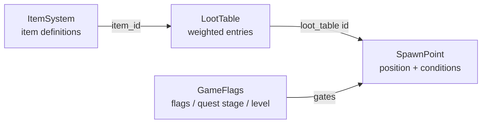

# Item System Architecture

This document describes the layered item/loot/placement architecture and the
debug tools used to author and validate it. It supersedes the "one flat item
struct" model — items are never hardcoded into a location.

## Why three layers?

| Layer | File | Answers |
|---|---|---|
| **Item Definition** | `src/systems/ItemSystem.ts` | *What* is this item? |
| **Spawn Point** | `src/systems/SpawnSystem.ts` | *Where* can something appear? |
| **Spawn Rule / Loot Table** | `src/systems/LootTable.ts` + `SpawnSystem.ts` | *What* appears there, and *under what condition*? |

A spawn point never references an item id directly — it references a
`loot_table` id, which is rolled at collection time. This means the same
chest can be re-skinned, re-balanced, or made difficulty-aware just by
changing data, with zero code changes.



---

## 1. Item Definition (`ItemSystem.ts`)

Items are composed from a shared `ItemBase` plus **one** category component,
stored in separate dictionaries keyed by item id (dictionary-of-arrays /
component pattern):

```ts
ItemBase { id, name, category, description, icon, shape, color, stackable, maxStack, rarity, sellValue }

ConsumableData { effectType: HealHP | HealMP | CureStatus | Buff, effects, target, consumeOnUse, usableIn }
EquipmentData  { slot: Weapon | Armor | Accessory, statMods: {atk, def, spd, magic}, elementAffinity? }
KeyItemData    { questId?, isDiscardable }
MaterialData   { usedInRecipes }
CurrencyData   { exchangeRate }
```

Registering an item:

```ts
itemSystem.registerItem({
  base: { id: 'mana_crystal', name: 'Mana Crystal', category: 'material',
          description: '...', icon: '💎', shape: 'octahedron', color: 0x66ccff,
          stackable: true, maxStack: 50, rarity: 'uncommon', sellValue: 20 },
  material: { usedInRecipes: ['staff_upgrade'] },
})
```

`ItemSystem` also exposes a **flattened `ItemDefinition`** view (`getDefinition(id)`)
merging `ItemBase` with the consumable fields — this is what `BattleSystem`,
`InventoryDisplay`, and `PlayerStatsSystem` consume; they never need to know
which dictionary the data actually lives in.

Category queries are cheap:

```ts
itemSystem.getItemsByCategory('equipment')   // ItemDefinition[]
itemSystem.getEquipmentData('iron_sword')    // EquipmentData | undefined
```

### Inventory storage

The player inventory is a single `InventorySlot[]` (`{ item, quantity }`),
shared across Navigation / Battle / Dialogue / Menu modes. Stackable items
merge into one slot (`quantity` acts like `Dictionary<ItemID, int>`);
non-stackable items (equipment, key items) get one slot per instance today.
If per-instance equipment stats/enchants are needed later, extend
`InventorySlot` with an optional `instanceData` field rather than
introducing a second storage model.

---

## 2 & 3. Spawn Point + Loot Table (`SpawnSystem.ts`, `LootTable.ts`)

### Loot table (reusable asset)

```json
{
  "table_id": "forest_common",
  "entries": [
    { "item_id": "potion_hp", "weight": 60, "min": 1, "max": 2 },
    { "item_id": "antidote", "weight": 25, "min": 1, "max": 1 },
    { "item_id": "phoenix_down", "weight": 5, "min": 1, "max": 1 }
  ]
}
```

Rolling uses cumulative-weight + random draw (`LootTableRegistry.roll()`),
the standard weighted-random approach. Example files:
`src/config/loot-tables/forest_common.json`, `forest_hard.json`.

### Spawn point (references a loot table, never an item)

```json
{
  "spawn_id": "forest_chest_03",
  "position": [120.5, 0, 88.2],
  "level": "whispering_forest",
  "loot_table": "forest_common",
  "loot_tables_by_difficulty": { "normal": "forest_common", "hard": "forest_hard" },
  "conditions": {
    "requires_flag": "met_elder",
    "not_yet_collected": true,
    "min_player_level": 0
  },
  "respawns": false
}
```

Example file: `src/config/spawns/whispering_forest.json`.

### Conditions supported

| Condition | Effect |
|---|---|
| `requires_flag` | Boolean story/dialogue flag must be set (`GameFlags.setFlag`) |
| `requires_quest_stage` | `{ quest_id, min_stage }` — quest must have reached that stage |
| `min_player_level` | Gate tier-3 loot out of the tutorial |
| `not_yet_collected` | `true` (default): locked once collected until respawn rule clears it. `false`: always available, ignoring collection history |
| `hidden` | Secret — always shown (distinctly, purple) in the **debug** visualizer; intended to be excluded from any future minimap/perception-check UI |

### Respawn rules

```ts
respawns: false                          // gone forever
respawns: true                           // refills every time the level is (re)activated
respawns: { interval_hours: 24 }         // daily reset (or any custom interval)
```

### Difficulty-scaled tables

A single spawn point can point at different loot tables per difficulty via
`loot_tables_by_difficulty`. Switch at runtime with
`spawnSystem.setDifficulty('hard')` (also exposed as `setSpawnDifficulty()`
on the console and a dropdown in the Debug GUI).

### Runtime flow

1. `spawnSystem.activateLevel(levelId)` — applies respawn rules, spawns
   world pickups for every currently-available spawn point.
2. Each frame, `spawnSystem.update(deltaTime, playerPosition)` bobs/spins
   pickups and auto-collects on proximity (1.6 units).
3. `collect(spawnId)` rolls the resolved loot table, adds the result to
   `ItemSystem`, marks the spawn collected+timestamped, and persists that
   state to `localStorage` — **independently** of the static spawn-point
   data, so redeploying config never wipes player progress.

---

## Debug Tools

All of the following are available both as `window.*` console commands and
as a **🎁 Item Spawns** folder in the Debug GUI (General tab).

### 1. In-scene spawn point visualizer

`toggleSpawnVisualizer()` — draws a wireframe sphere + pickup-radius ring +
text-sprite label at every registered spawn point, color-coded:

- 🟢 green — available now
- 🔴 red — condition not met (flag/quest/level gate failed)
- ⚪ gray — already collected
- 🟣 purple — `hidden`/secret (still shown for developers)

### 2. Debug overlay / heatmap mode

`toggleLootHeatmap()` — draws a translucent disk at every spawn point,
colored on a blue→red scale by the loot table's aggregate value
(rarity-weighted sum of entry weights). Useful for spotting loot deserts or
over-stuffed areas at a glance.

### 3. Console commands

```js
listSpawnPoints()
spawnPointInfo('forest_chest_03')
toggleSpawnVisualizer()
toggleLootHeatmap()
rollLoot('forest_common', 1000)       // tally drop rates
printLootTables()
forceCollectSpawn('forest_chest_03')
resetSpawn('forest_chest_03')
resetAllSpawns()
addSpawnPointHere('new_chest_01', 'whispering_forest', 'forest_common')
exportSpawnPoints('whispering_forest')
importSpawnPoints(jsonString)
validateSpawnData()
setSpawnDifficulty('hard')
setStoryFlag('met_elder', true)
printGameFlags()
```

### 4. Save/load of spawn-point authoring data

Same pattern as `exportObjectPositions()`: `exportSpawnPoints(level?)` prints
(and copies to clipboard) JSON for every spawn point, ready to paste into
`src/config/spawns/<level>.json`. `addSpawnPointHere(id, level, lootTable)`
drops a new spawn point at the player's current position for fast in-editor
placement; `importSpawnPoints(json)` hot-loads JSON back in without a reload
so you can iterate quickly.

### 5. Condition validator (offline lint)

`validateSpawnData()` / `spawnSystem.validate()` checks, across all
registered spawn points and loot tables:

- Duplicate `spawn_id`s
- `loot_table` (and each `loot_tables_by_difficulty` entry) references a
  registered table
- Loot table entries reference real `item_id`s in `ItemSystem`
- Weights are positive and the table's total weight is > 0
- `min`/`max` quantities are sane (`min >= 1`, `max >= min`)
- Negative `min_player_level` / `requires_quest_stage.min_stage`

Run it any time via the console or the Debug GUI button; it only warns
(non-throwing) so it's safe to call in production too.

---

## Adding a new item

1. Add an `ItemRegistration` to `DEFAULT_ITEM_CATALOGUE` in `ItemSystem.ts`
   (or call `itemSystem.registerItem(...)` at runtime).
2. Reference its `id` from one or more loot table entries — never from a
   spawn point directly.

## Adding a new spawn point

1. Add an entry to `src/config/spawns/<level>.json` (or use
   `addSpawnPointHere()` + `exportSpawnPoints()` to author it in-scene).
2. Point it at an existing (or new) `loot_table` id.
3. Run `validateSpawnData()` before committing.

---

## Potion Scatter (`PotionScatterSystem.ts`)

Procedurally sprinkles potion pickups across a level instead of hand-placing
them. It's a thin layer on top of `SpawnSystem` — it just registers ordinary
spawn points (referencing a shared `potion_scatter` loot table: potion /
potion_hp / ether) at seeded, non-overlapping positions, so it participates
in the exact same conditions/respawn/visualizer/heatmap machinery as any
other spawn point.

- Placement: uniform-disc sampling around a `center` within `radius`,
  rejection-sampled against `minSpacing` (skips a point rather than
  overlapping if no free spot is found after 30 attempts).
- Height: snapped to `CollisionSystem.getGroundHeight(x, z)` when available.
- Reproducible: a `seed` drives a small deterministic RNG (mulberry32) —
  same seed + config always regenerates the same layout.
- Respawns on an hours-based timer (`respawnHours`, default 12h) by default.

```js
scatterPotions(30, 80, 6, 6)   // count, radius, minSpacing, respawnHours
regenerateScatteredPotions()  // new seed, re-roll layout
clearScatteredPotions()
printPotionScatterConfig()
```

Also available as a **🧪 Potion Scatter** sub-folder under **🎁 Item Spawns**
in the Debug GUI (count/radius/spacing/respawn sliders + Scatter Now /
Regenerate / Clear buttons), and reuses the existing spawn visualizer/heatmap
toggles to preview the layout in-scene.

